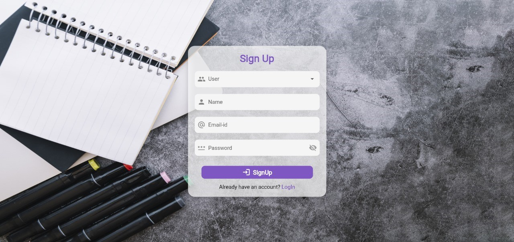
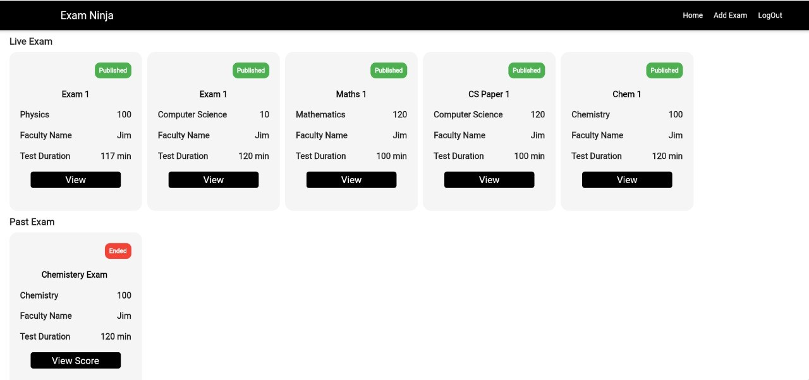
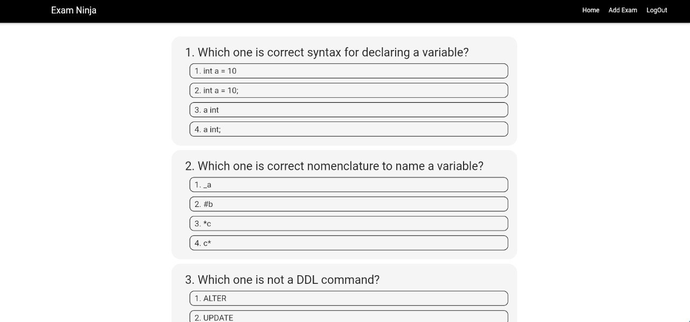
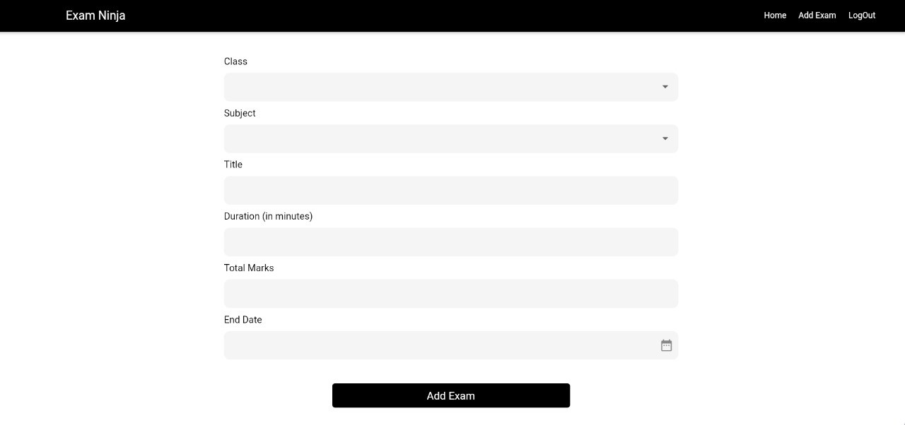
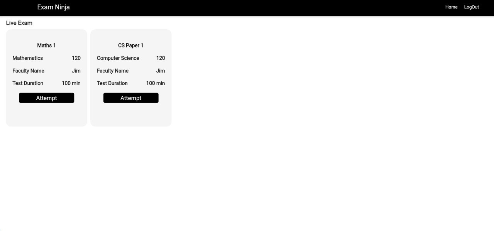
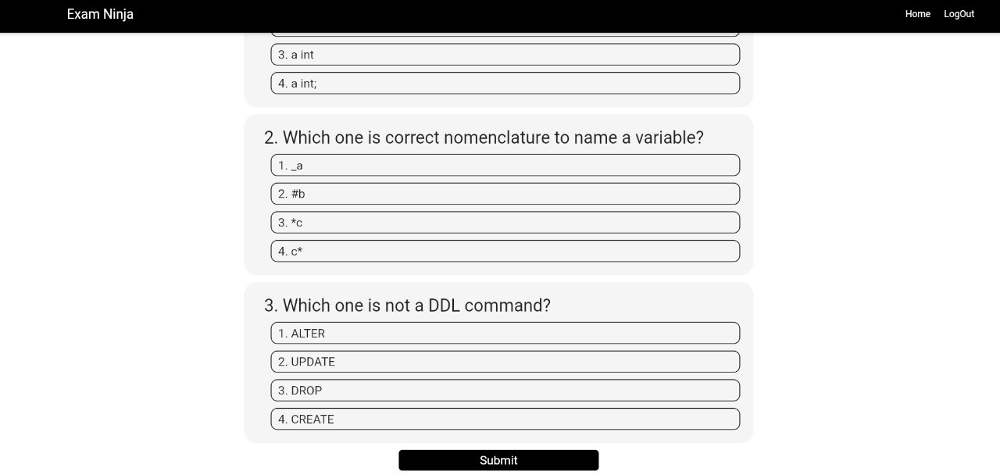
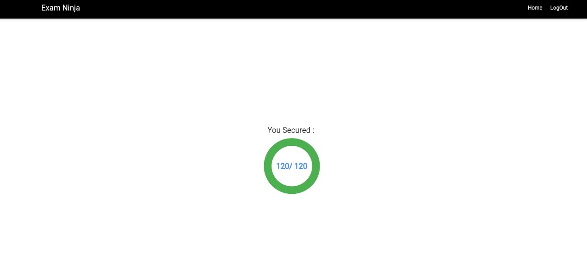

# ExamNinja

Welcome to ExamNinja – Your Ultimate Online Exam Platform!

## Overview

ExamNinja is a powerful and user-friendly online exam portal designed to streamline the testing and assessment process. Whether you're an educator, or learner, ExamNinja provides a seamless experience for creating and taking exams.

## Getting Started

This project is a starting point for a Flutter application.

A few resources to get you started if this is your first Flutter project:

- [Lab: Write your first Flutter app](https://docs.flutter.dev/get-started/codelab)
- [Cookbook: Useful Flutter samples](https://docs.flutter.dev/cookbook)

For help getting started with Flutter development, view the
[online documentation](https://docs.flutter.dev/), which offers tutorials,
samples, guidance on mobile development, and a full API reference.

## Screenshots

### Auth Screen

#### Login Screen

#### SignUp Screen

### Teacher Screen

#### Teacher DashBoard

#### Teacher Dashboard View Question

#### Add Exam Screen

### Student Screen

#### Student Dashboard

#### Student Exam Screen

#### Result Screen

